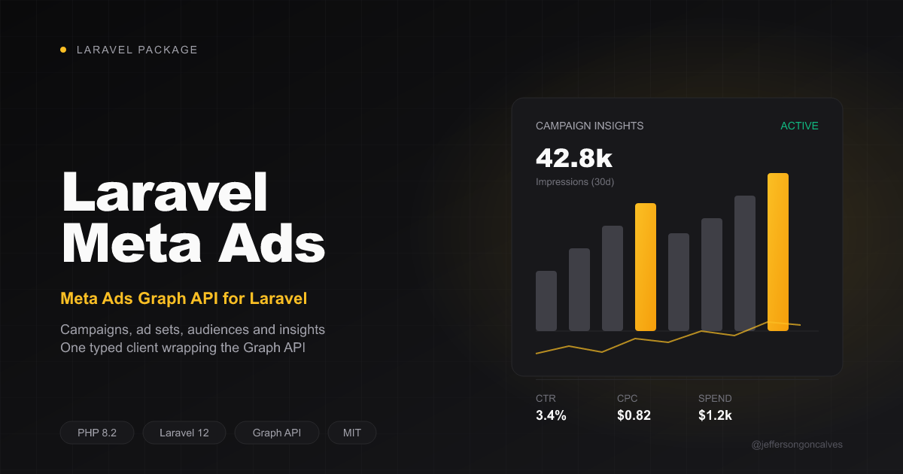

# Laravel Meta Ads

Laravel integration for the Meta Ads (Facebook/Instagram Ads) Graph API

## Installation

You can install the package via composer:

```bash
composer require jeffersongoncalves/laravel-meta-ads
```

Publish the config file:

```bash
php artisan vendor:publish --tag="laravel-meta-ads-config"
```

Set your credentials in `.env`:

```env
META_ACCESS_TOKEN=
META_AD_ACCOUNT_ID=
META_ADS_API_VERSION=v18.0
```

## Usage

```php
use Jeffersongoncalves\LaravelMetaAds\Facades\LaravelMetaAds;

LaravelMetaAds::accounts();

LaravelMetaAds::campaigns(); // uses META_AD_ACCOUNT_ID by default
LaravelMetaAds::campaigns('123456789'); // or pass an ad account id explicitly

LaravelMetaAds::campaignInsights(campaignId: '120099', datePreset: 'last_30d');

LaravelMetaAds::createCampaign(name: 'My Campaign', objective: 'OUTCOME_TRAFFIC', status: 'PAUSED');

LaravelMetaAds::updateCampaignStatus(campaignId: '120099', status: 'ACTIVE');

LaravelMetaAds::adSets();

LaravelMetaAds::ads(adSetId: '120088');

LaravelMetaAds::audiences();

LaravelMetaAds::createLookalikeAudience(sourceId: '120077', country: 'US');
```

Every method returns an `Illuminate\Http\Client\Response`, so you can chain `->json()`, `->throw()`, etc.

## Testing

```bash
composer test
```

## Changelog

Please see [CHANGELOG](CHANGELOG.md) for more information on what has changed recently.

## Contributing

Please see [CONTRIBUTING](CONTRIBUTING.md) for details.

## Security

If you discover any security related issues, please email the author instead of using the issue tracker.

## Credits

- [jeffersongoncalves](https://github.com/jeffersongoncalves)
- [All Contributors](../../contributors)

## License

The MIT License (MIT). Please see [License File](LICENSE.md) for more information.
